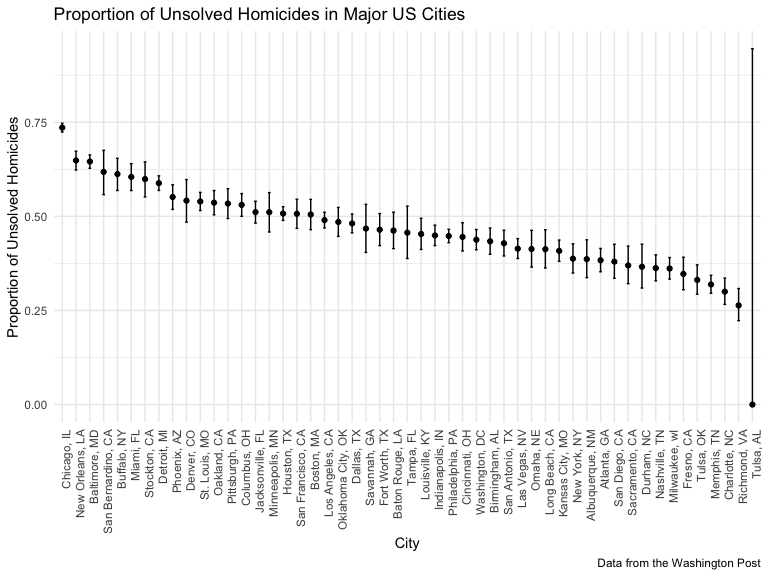

p8105_hw5_maf2311
================
Mackenzie Frost (maf2311)

November 11, 2022

# Problem 1

A tidy dataframe containing data from all participants, including the
subject ID, arm, and observations over time:

Tidied result - file names include control arm and subject ID

``` r
final = 
  full_df %>% 
  mutate(
    names = str_replace(names, ".csv", ""),
    group = str_sub(names, 1, 3)) %>% 
  pivot_longer(
    week_1:week_8,
    names_to = "week",
    values_to = "outcome",
    names_prefix = "week_") %>% 
  mutate(week = as.numeric(week)) %>% 
  select(group, subj = names, week, outcome)
```

### Spaghetti plot showing observations on each subject over time

``` r
final %>% 
  ggplot(aes(x = week, y = outcome, group = subj, color = group)) + 
  geom_point() + 
  geom_path() + 
  facet_grid(~group)
```


In this plot, you can see the control group does not change much over
time, whereas the experimental group increases significantly by the end
of week 8.

# Problem 2

Homicides in 50 large US cities, Washington Post

``` r
homicides = read_csv(file = "./data-homicides-master/homicide-data.csv") %>%
  mutate(
    city_state = str_c(city, ", ", state)
  )
```

    ## Rows: 52179 Columns: 12
    ## ── Column specification ────────────────────────────────────────────────────────
    ## Delimiter: ","
    ## chr (9): uid, victim_last, victim_first, victim_race, victim_age, victim_sex...
    ## dbl (3): reported_date, lat, lon
    ## 
    ## ℹ Use `spec()` to retrieve the full column specification for this data.
    ## ℹ Specify the column types or set `show_col_types = FALSE` to quiet this message.

``` r
summary = homicides %>%
  group_by(city_state) %>%
  summarise(
    total_homicides = n(),
    unsolved = sum(disposition == "Closed without arrest" | disposition == "Open/No arrest")
  )

summary
```

    ## # A tibble: 51 × 3
    ##    city_state      total_homicides unsolved
    ##    <chr>                     <int>    <int>
    ##  1 Albuquerque, NM             378      146
    ##  2 Atlanta, GA                 973      373
    ##  3 Baltimore, MD              2827     1825
    ##  4 Baton Rouge, LA             424      196
    ##  5 Birmingham, AL              800      347
    ##  6 Boston, MA                  614      310
    ##  7 Buffalo, NY                 521      319
    ##  8 Charlotte, NC               687      206
    ##  9 Chicago, IL                5535     4073
    ## 10 Cincinnati, OH              694      309
    ## # … with 41 more rows

The raw data includes variables related to the record information,
victim information, location, and notes about the record. There are
52179 records and 12 variables. I created a variable that combines the
city and the state information, to have 13 variables total.

``` r
baltimore = summary %>%
  filter(city_state == "Baltimore, MD")

unsolved_prop_baltimore = prop.test(baltimore$unsolved[1], baltimore$total_homicides[1]) %>%
  broom::tidy()

unsolved_prop_baltimore
```

    ## # A tibble: 1 × 8
    ##   estimate statistic  p.value parameter conf.low conf.high method        alter…¹
    ##      <dbl>     <dbl>    <dbl>     <int>    <dbl>     <dbl> <chr>         <chr>  
    ## 1    0.646      239. 6.46e-54         1    0.628     0.663 1-sample pro… two.si…
    ## # … with abbreviated variable name ¹​alternative

Estimate proportion and confidence interval of unsolved homicides in
Baltimore, MD:

0.6455607, (0.6275625, 0.6631599)

``` r
unsolved_prop = function(x){

  values = summary %>%
  filter(city_state == x)

unsolved_prop_test = prop.test(values$unsolved[1], values$total_homicides[1]) %>%
  broom::tidy()
  
tibble(
  proportion = unsolved_prop_test %>% pull(estimate),
  lower = unsolved_prop_test %>% pull(conf.low),
  upper = unsolved_prop_test %>% pull(conf.high)
)
}

summary = 
  summary %>%
  mutate(
    prop_test = map(summary %>% pull(city_state), unsolved_prop)
  ) %>%
  unnest(cols = prop_test)

ggplot(summary, aes(x = reorder(city_state, -proportion), y = proportion)) + 
  geom_point() +
  geom_errorbar(aes(ymin = lower, ymax = upper), width = 0.2) +
  labs(
    title = "Proportion of Unsolved Homicides in Major US Cities",
    x = "City",
    y = "Proportion of Unsolved Homicides",
    caption = "Data from the Washington Post"
  ) +
  theme(axis.text.x = element_text(angle=90, hjust=1))
```



# Problem 3

When designing an experiment or analysis, a common question is whether
it is likely that a true effect will be detected – put differently,
whether a false null hypothesis will be rejected. The probability that a
false null hypothesis is rejected is referred to as power, and it
depends on several factors, including: the sample size; the effect size;
and the error variance. In this problem, you will conduct a simulation
to explore power in a one-sample t-test.

First set the following design elements:

Fix n=30 Fix σ=5 Set μ=0. Generate 5000 datasets from the model

x∼Normal\[μ,σ\]

For each dataset, save μ̂ and the p-value arising from a test of H:μ=0
using α=0.05. Hint: to obtain the estimate and p-value, use broom::tidy
to clean the output of t.test.

Repeat the above for μ={1,2,3,4,5,6}, and complete the following:

Make a plot showing the proportion of times the null was rejected (the
power of the test) on the y axis and the true value of μ on the x axis.
Describe the association between effect size and power. Make a plot
showing the average estimate of μ̂ on the y axis and the true value of μ
on the x axis. Make a second plot (or overlay on the first) the average
estimate of μ̂ only in samples for which the null was rejected on the y
axis and the true value of μ on the x axis. Is the sample average of μ̂
across tests for which the null is rejected approximately equal to the
true value of μ? Why or why not?
